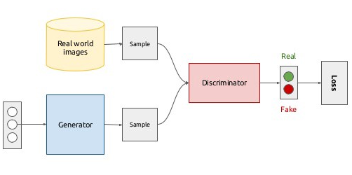
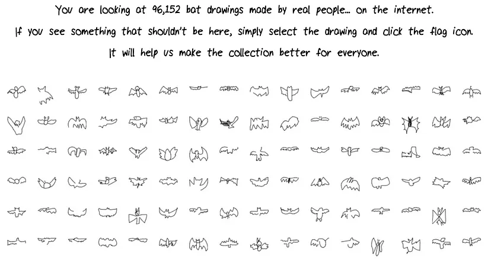
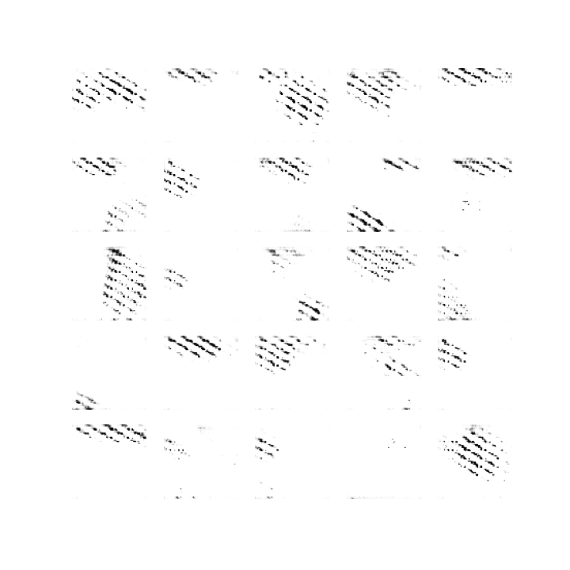
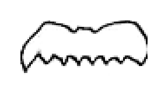

# Teaching a GAN to draw bats

## A Deep Convolutional GAN trained to draw doodles of bats

### Generative Adversarial Networks
G
enerative Adversarial Networks (GANs) are an approach to generative modeling where the problem is wittily posed as a supervised learning problem with two sub-models. The two sub-models are

1. A *generator* — This model plays the role of an apprentice trying to learn a skill
2. A *discriminator* — This model plays the role of an expert in the skill that the apprentice is trying to master

The discriminator’s task is to differentiate between the real images from the dataset and the images drawn (produced) by the generator. The generator’s task is to generate images in such a way that the discriminator cannot easily differentiate if the image was produced by the generator or was, in fact, a part of the original dataset of images.

The generator and discriminator, therefore, play a zero-sum game where the discriminator tries to get better at spotting the fakes (generated images). On the other hand, the generator tries to get better at creating images that the discriminator cannot perceive as fake. Here, in technical terms, the discriminator learning to differentiate implies the minimization of the classification loss of the discriminator, and the generator learning to draw (produce images) implies the maximization of the discriminator’s classification loss. 

In this project, I outline a way to generate doodles representing the superhero of the century — Batman!

### Dataset

This project is inspired by [Google’s quick-draw dataset](https://quickdraw.withgoogle.com/data). Google’s quick-draw is a game similar to [skribbl](https://skribbl.io/), with one exception: the opponents in the game are not your friends but a neural network trying to get better at the game. This game thus led to the collection of the world’s largest open-source doodle dataset.

Although the original purpose of the game was to train a neural network classifier that can identify what a doodle is, many people have used the dataset for more interesting deep learning, artistic, and creative projects. Here are some interesting ones

1. [Scribbling Speech](http://xinyue.de/scribbling-speech.html) — A project that converts a speech prompt into a sketch
2. [The way you draw circles says a lot about you](https://qz.com/994486/the-way-you-draw-circles-says-a-lot-about-you)
3. [Visual Averages](https://twitter.com/kcimc/status/902229612666658816) — A tweetstorm by Kyle McDonald on cultural insights by visualizing the average drawings by country

### Results

Finally, let’s look at the images the model generates. Here we have a visualization of how the model outputs look after every epoch. While some of the images tend to get better, some also deviated from looking like bats. Overall, I did observe great doodles with some seeds. The output is certainly not perfect but nonetheless, close to what most of us could draw.

> Let’s see what the generator generates after each epoch of training for the same input vectors (25 vectors)
> 
> 

> Let’s see how changing the input vector (random values) and moving the input vector around in the input space makes a difference in what images it produces
> 
> 

### References

1. A [Medium blog](https://medium.com/@chyavan.m.c/teaching-a-gan-to-draw-bats-f97520ac3e86) with a more detailed explanation including code-snippets
2. A supplemented [YouTube video](https://youtu.be/3xMbBkhyIO4) that provides a quick overview of our project
3. [Google AI’s blog on the QuickDraw Dataset](https://ai.googleblog.com/2017/08/exploring-and-visualizing-open-global.html)
4. [A Gentle Introduction to Generative Adversarial Networks (GANs)
by Jason Brownlee](https://machinelearningmastery.com/what-are-generative-adversarial-networks-gans/)
5. [Generative Adversarial Networks — Ian J. Goodfellow, et. al.](https://arxiv.org/abs/1406.2661)